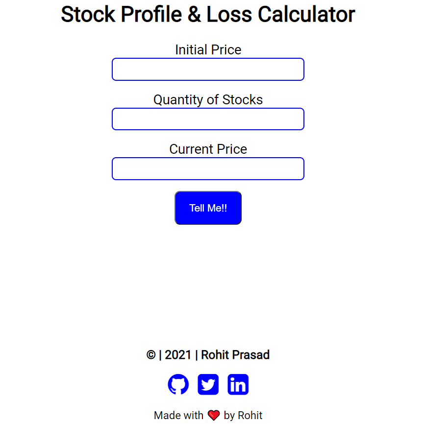

# Stock Profile Calculator App

This app calculates the total profit or loss of a stock, also display the total percentage of profit/loss.

## Interface of the app.

## How to use the app:

1. Enter the initial stock price for one stock.
2. Enter the number of stocks(quantity).
3. Enter the current stock price.
4. Click on Tell me button.
5. Displays the output in absolute and percentage.

## Tech Stack used:

1. HTML
2. CSS
3. JavaScript

## Link of the app:

[Stock Profile calculator](https://rohit-mark-14-stock-calculator.netlify.app/)